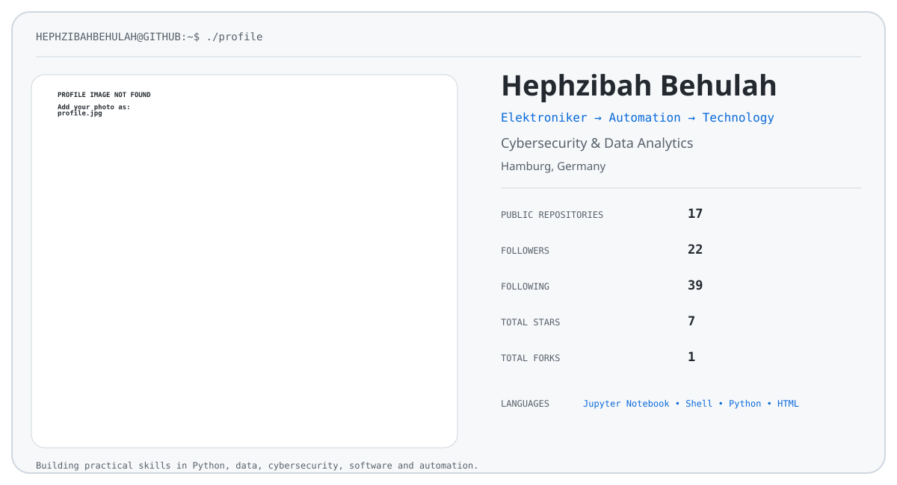

# Hephzibah Behulah

<picture>
  <source media="(prefers-color-scheme: dark)" srcset="dark_mode.svg">
  
</picture>

---

```text
Hephzibahbehulah@profile
------------------------------------------------------------
OS:                  Windows 11 | Linux | Android
Location:            Hamburg, Germany
Role:                Elektroniker
Focus:               Cybersecurity & Data Analytics
Career Path:         Electronics → Automation → Technology
IDE:                 Visual Studio Code
------------------------------------------------------------

Languages.Programming:
                     Python | JavaScript | SQL
Languages.Web:
                     HTML | CSS
Languages.Data:
                     Pandas | NumPy | Matplotlib
Languages.Computer:
                     JSON | YAML

Languages.Spoken:
                     English | German
------------------------------------------------------------

Tech.Interests:
                     Cybersecurity
                     Data Analytics
                     Python
                     Machine Learning
                     Web Development
                     MERN Stack
                     PLC & Industrial Automation
                     Electronics
------------------------------------------------------------

Background:
                     Electronics & Electrical Systems
                     Industrial Automation
                     PLC Technology
                     Technical Troubleshooting
                     System Diagnostics

Currently.Learning:
                     Cybersecurity
                     Data Analytics
                     Python
                     SQL
                     Machine Learning
                     Software Development

Future.Direction:
                     Cybersecurity
                     Data Analytics
                     Technology & Automation
------------------------------------------------------------

GitHub:
                     github.com/Hephzibahbehulah
------------------------------------------------------------
